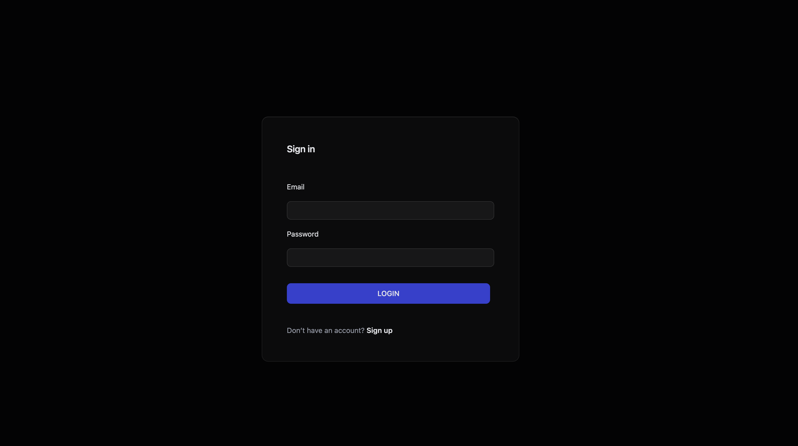
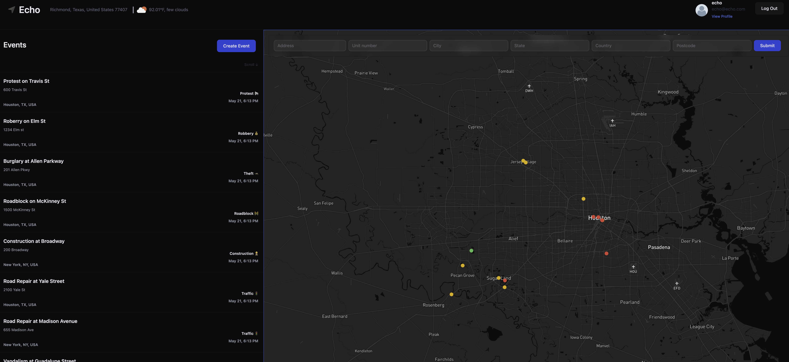
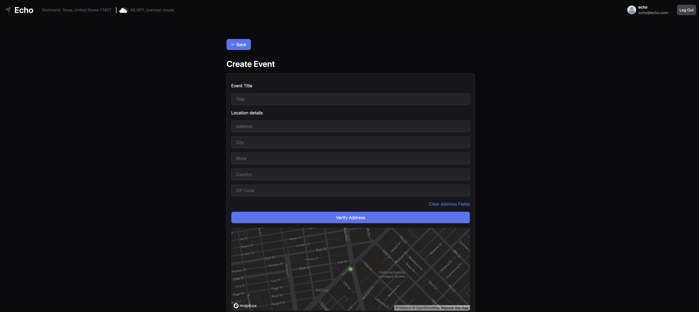

# Echo

## Screenshots

Sign in Page

Landing Page

Create Event Page

## Description

Echo is a user-friendly app designed to keep your community informed and safe. With Echo, you can quickly report crimes, traffic incidents, and other disruptive events in real-time. Stay connected with local updates and contribute to a safer environment for everyone. Your voice helps echo important information across the community.

## Table of contents

- [Description](#description)
- [Screenshots](#screenshots)
- [Technologies Used](#technologies-used)
- [Getting Started](#getting-started)
- [Credits](#credits)
- [Future Enhancements](#future-enhancements)
- [Questions](#questions)

## Technologies Used

- HTML
- CSS
- JavaScript
- React
- Tailwind
- Express.js
- MongoDB
- Moongose

## Getting Started

1 - Access the [website](https://echo-app-2-123bb946dec5.herokuapp.com/).  
2 - Create your credentials to be able to access the website.  
3 - Upon sucessfull sign-in the user will be redirect to the landing page.  
4 - The website will attemp to look for the users location.  
5 - The user can look for events near you or around the map.  
6 - The user can create events and upload images.  
7 - The user can add story timeline to your events.  
8 - The user can edit and delete all the events and timeline created.  
9 - Link to [trello](https://trello.com/invite/b/soYxoDsY/ATTI6041e05592142c0a1556645868b4f1520282070C/echo) project planning.

## Credits

[Miguel Coria](https://github.com/miguelcoria94) and [Tatiana Bertazoli](https://github.com/TBertazoli)

## Future Enhancements

1 - Add goggle Oauth option  
2 - Option to add more than one image/video  
3 - Add comments

## Questions

For questions please contact: [Tatiana Bertazoli](tatianabertazoli@gmail.com) or [Miguel Coria](miguelcoria94@gmail.com)

[GitHub Link](https://github.com/TBertazoli/echo)

[Heroku Link](https://echo-app-2-123bb946dec5.herokuapp.com/)
